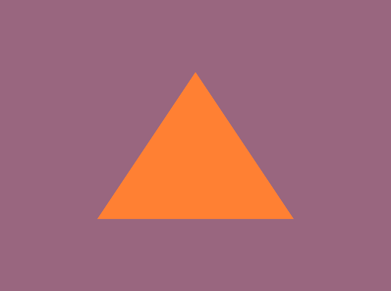

# LearnOpenGL

This repo is for documenting my progress with the  chapters

## Getting Started

### 

In the first few chapters I learned how to set up GLFW and GLAD, create a window, and draw a triangle.

I also learned how to set up CMake in the process which allowed me to have multiple .exe applications within different folders so I can make seperate applications for the chapters and exercises to showcase and document each and every step of my progress.

### First Triangle

First thing I did was specify my triangle's vertices and define them in a float array, then I create a VBO (Vertex Buffer Object) and a VAO (Vertex Array Object), bind and assign data to a buffer for OpenGL to use, setting a pointer to where it should start looking at my vertices. And lastly, I create a Shader Program and attach the variables that contain my vertex shader and fragment shader to it, activate the program and bind the VBO and VAO to draw my triangle, then delete all these resources once it's done before closing the glfw window.

### 

#### **First Exercise**

Drawing 2 triangles next to each other.

#### **Second Exercise**

Drawing 2 triangles with different Vertex Array Objects and Vertex Buffer Objects.

#### **Third Exercise**

Creating 2 shader programs where the programs use different fragment shaders that output different colors.

### 

In this chapter I learned how to understand, write and work with vertex shaders and fragment shaders, as well as organizing my source files, header files and shader files.

### 

#### **First Exercise**

Adjusting the vertex shader so that the triangle is upside down by simply putting a negative sign in front of the y value `aPos.y` in the vertex shader file.

#### **Second Exercise**

Creating a horizontal offset via a `uniform float` within the ShaderClass source file using the `setFloat()` method, and then moving the triangle to the right side of the screen in the vertex shader using this offset value by adding it to the x value `aPos.x` in the vertex shader file.

#### **Third Exercise**

Outputing the vertex position to the fragment shader using the `out` keyword and setting the fragment color to this vertex position, noticing in the process that the bottom left corner of the triangle was black due to the vertex position having negative values and the RGB values' range is 0-1 so the negative values always clamp to `0.0f` within the RGB context.

